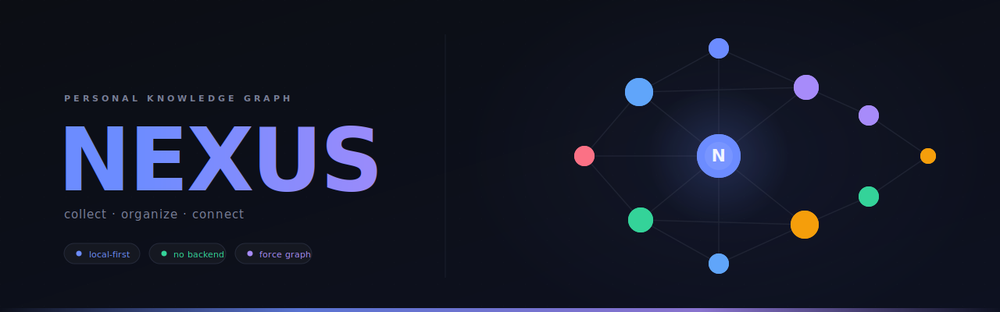

<p align="center">
  
</p>

[](https://github.com/nro337/nexus/actions/workflows/ci.yml)
[](https://github.com/nro337/nexus/actions/workflows/lighthouse.yml)
[](https://github.com/nro337/nexus/actions/workflows/a11y.yml)
[](https://github.com/nro337/nexus/actions/workflows/codeql.yml)
[](https://scorecard.dev/viewer/?uri=github.com/nro337/nexus)
[](LICENSE)
[](https://www.typescriptlang.org/)

A local-first browser application for collecting, organizing, and connecting information from across the web. Runs entirely in-browser with no backend — your data stays in IndexedDB.

## Features

- **Quick Capture** — Save links, snippets, and notes via the app, Chrome extension, or bookmarklet (Cmd+K)
- **Smart Organization** — Tag resources, filter by type/source, full-text fuzzy search
- **Knowledge Graph** — Visualize connections between resources as an interactive force-directed graph
- **Data Portability** — Export your entire knowledge base as JSON, commit to Git for version history
- **Internationalization** — Full i18n support with language toggling; currently ships English, Spanish, French, German, Portuguese, Italian, Japanese, Simplified Chinese, and Arabic (RTL)

## Tech Stack

- React 18 + TypeScript + Vite
- Dexie.js (IndexedDB) for local storage
- Fuse.js for fuzzy full-text search
- react-force-graph-2d for graph visualization
- Zustand for state management
- Tailwind CSS v4

## Getting Started

```bash
npm install
npm run dev
```

Open [http://localhost:5173](http://localhost:5173)

## Chrome Extension

1. Navigate to `chrome://extensions`
2. Enable "Developer mode"
3. Click "Load unpacked" and select the `extension/` directory
4. Use the extension popup or right-click context menu to save pages to Nexus

## Bookmarklet

Visit `/bookmarklet.html` from your running Nexus instance to install the bookmarklet.

## Data Export

From the app, export your data as `nexus-backup.json` and commit to this repo for version history.

## Project Structure

```
src/
├── db/           # Dexie database schema + CRUD operations
├── store/        # Zustand state stores
├── components/   # React components (layout, capture, resources, graph, search)
├── pages/        # Page-level components
├── lib/          # Utilities (search, metadata, helpers)
└── types/        # TypeScript type definitions

extension/        # Chrome Extension (Manifest V3)
```

## Contributing

Contributions are welcome! Please read [CONTRIBUTING.md](CONTRIBUTING.md) for guidelines on reporting bugs, requesting features, and submitting pull requests.

Please note that this project is released with a [Contributor Code of Conduct](CODE_OF_CONDUCT.md). By participating you agree to abide by its terms.

## Internationalization (i18n)

Nexus ships with full internationalization support powered by [i18next](https://www.i18next.com/) and [react-i18next](https://react.i18next.com/). The language can be toggled from the header dropdown or from **Settings → Language**.

### Currently supported languages

| Code | Language       | Direction |
|------|----------------|-----------|
| `en` | English        | LTR       |
| `es` | Español        | LTR       |
| `fr` | Français       | LTR       |
| `de` | Deutsch        | LTR       |
| `pt` | Português      | LTR       |
| `it` | Italiano       | LTR       |
| `ja` | 日本語          | LTR       |
| `zh` | 中文 (Simplified)| LTR     |
| `ar` | العربية        | RTL       |

### Reporting a translation issue or requesting a new language

If you find a mistranslation, missing string, or want to request support for a new language, please **open a GitHub issue** using the template below.

**For translation issues:**
1. Click [New Issue](../../issues/new) and choose the _Translation Issue_ label.
2. Include:
   - **Language code** (e.g. `fr`)
   - **Location** — page / component where the problem appears
   - **Current text** — what the string currently says
   - **Suggested text** — your preferred translation
   - _(Optional)_ A screenshot

**For new language requests:**
1. Click [New Issue](../../issues/new) and choose the _New Language_ label.
2. Include:
   - The **language name** and its [BCP 47 code](https://www.iana.org/assignments/language-subtag-registry) (e.g. `ko` for Korean)
   - Whether it requires **RTL** layout
   - Whether you are willing to provide the initial translation

### Adding a new language yourself

1. Copy `src/i18n/locales/en.json` to `src/i18n/locales/<code>.json` and translate every value.
2. Register the locale in `src/i18n/index.ts`:
   - Import the JSON file.
   - Add an entry to the `SUPPORTED_LANGUAGES` array (include `code`, `label`, and `dir`).
   - Add the resource to the `i18n.init()` call.
3. Open a pull request — the CI suite will verify the build passes.


## Security

To report a vulnerability, please follow the process described in [SECURITY.md](SECURITY.md). **Do not open a public issue for security reports.**

## License

[MIT](LICENSE) © nro337 — open source with attribution required (keep the copyright notice).
